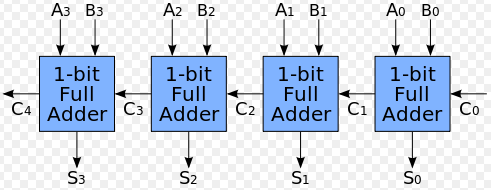

## 組成電腦的基礎元件 -- 邏輯閘

在 [上期的少年科技人雜誌] 當中，我們探討了「電腦的歷史、工業與結構」這個議題，並且在 [透視電腦的內部結構](http://programmermagazine.github.io/y201410/htm/focus2.html) 這篇文章中看到了電腦的基本組成元件，那就是邏輯閘。

在接下來的幾期當中，我們將逐步的從邏輯閘開始，解說「電腦是如何用邏輯閘所組成的」這個問題。

組成電腦的基本邏輯閘包含 AND、OR、NOT、XOR 等四種，其中 AND、OR、NOT 三種就可以組成所有電路，包含 XOR，但是加上 XOR 時會比較方便，因為在有些電路上用 XOR 可以大量減少邏輯閘的數量。

### 基本邏輯閘 (Logic Gate)

反閘 (NOT) 的圖示與功能如下，其輸入輸出都只有一條，當輸入 0 的時候就輸出 1，而輸入 1 的時候就輸出 0。


及閘 (AND) 的圖示與功能如下，其輸入有兩條，輸出只有一條，當輸入 11 的時候才會就輸出 1，其他三種情況則一律輸出 0。


換言之、AND 是在 A B 兩者都為 1 的時候才會輸出 1，這和邏輯學上的「且」(AND) 相同，當我們說「他高且帥」的時候，代表他同時具有「高」和「帥」兩個特性。

或閘 (OR) 的圖示與功能如下，其輸入有兩條，輸出只有一條，當輸入 00 的時候才會就輸出 0，其他三種情況則一律輸出 1。


換句話說、只要 A B 兩者當中有一個為 1，那麼輸出就會是 1，這和邏輯學上的「或」(OR) 相同，當我們說「高或帥」的時候，代表他只要具備「高」或「帥」其中一個特性就滿足了條件。

互斥或閘 (XOR) 的圖示與功能如下，其輸入有兩條，輸出只有一條，當兩條不一樣的時候就輸出 1，兩者一樣的時候則會輸出 0。


有了上述邏輯閘之後，我們就可以用這樣的閘來組成電腦當中最核心的一個運算，那就是加法了。

但是、要理解如何用邏輯閘組成加法運算之前，我們必須先了解二進位這個概念。

### 半加器與全加器
 
將兩個輸入相加的電路，稱為「半加器」(half adder)，而將三個輸入相加的電路，則稱為「全加器」(full adder)。


半加器的電路如上圖所示，而其輸入輸出的真值表如下所示：

```
A + B → S, 進位 C
0 + 0 → 0       0 
0 + 1 → 1       0
1 + 0 → 1       0
1 + 1 → 0,      1 (因為 1 + 1 = 2 = 0 + (1 × 2) )
```

上述的輸出 S 只有在 A , B 兩者不同的時候才會是 1，這完全符合 XOR 電路的行為模式，因此我們可以用一個 XOR 電路輕易地完成 S 的輸出動作。

而 C 則是在 A, B 兩者均為 1 的情況下才會是 1，否則就會是 0。這與 AND 閘的真值表完全一致，因此我們只要用一個 AND 閘就可以做到 C 的功能了。

但是、雖然我們想做的事情是兩組二進位數字的加法，但是由於相加之後可能會產生進位，因此必須要考慮到三個位元相加的情況，這時就需要將半加器進一步擴充為全加器，以便進行三位元相加的運算。

以下是全加器的電路圖與真值表，其中的輸出 S 只要用兩個 XOR 閘就能做到，因為 S 只有在奇數個 1 的時候才會輸出 1，偶數個 1 的時候就會輸出 0，這種組合完全符合 n 輸入的 XOR 閘之行為。


但是對於輸出 C 而言，則需要兩個 AND 閘和一個 OR 閘連接之後才能達成，您可以根據上面的 AND, OR 之真值表定義，驗證一下該電路的輸出是否真的符合上圖真值表的要求，這會是一個很好的練習。

在此、我們直接提出了全加器的電路圖，而沒有展示這個電路的「設計過程」，因為這種設計過程牽涉到一種稱為「卡諾圖」的電路化簡工具，

* [維基百科：卡諾圖](http://zh.wikipedia.org/zh-tw/%E5%8D%A1%E8%AF%BA%E5%9B%BE)
* [Wikipedia:Karnaugh_map](http://en.wikipedia.org/wiki/Karnaugh_map)

### 二進位加法電路

有了上述的全加器電路之後，我們就可以任意地進行三個位元的加法，於是只要我們將這些全加器一個接一個的串起來，並將進位輸出到下一個全加器當中，就可以任意地做出 n 位元的加法器電路了，以下是一個四位元加法器的圖示。



當您能做出 n 位元加法器時，應該就可以理解為何電腦的基本組成會是「邏輯閘」了，因為我們可以輕易地串接出 32 位元的加法器，當然也可以用類似的原理做出「減法器、乘法器、除法器」，然後做出整顆「中央處理器」(CPU)，甚至是整台電腦的數位電路了。


### 參考文獻
* [維基百科：邏輯閘](http://en.wikipedia.org/wiki/Logic_gate)
* [維基百科：加法器](http://zh.wikipedia.org/wiki/%E5%8A%A0%E6%B3%95%E5%99%A8)


