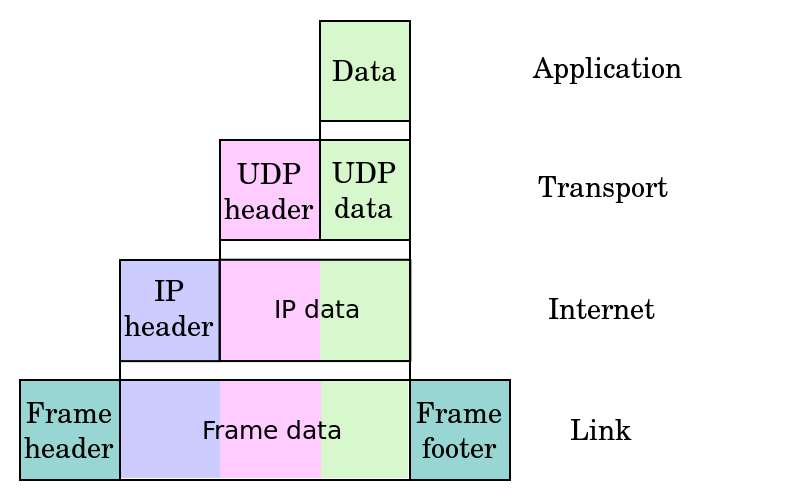

## 網路技術的歷史: 從 ARPANet、Internet 到 Web 

在 1950 年代，通信研究者認識到需要允許在不同計算機用戶和通信網路之間進行常規的通信。這促使了分散網路和封包交換的研究。1960 年美國國防部高等研究計劃署（ARPA）出於冷戰考慮建立的ARPA網引發了技術進步並使其成為互聯網發展的中心。1973 年 ARPA網 擴展成可國際互通的互聯網（Internet)，第一批接入的有英國和挪威計算機。

### 阿帕網 (ARPANet)

1960年代、美國國防部先進研究中心（Advanced Research Project Agency, ARPA) 是一個超級有錢的研究單位，當時 ARPA 掌控了全美國科學領域研究中70%的資金，雖然 ARPA 所補助的項目常常與國防沒有明顯的關係。

但是、正因為如此，ARPA反而成為許多現代重要科技的發源地，像是網路、電腦繪圖、平行處理、模擬飛行等科技都是在 ARPA 的資助下誕生的。

1966年鮑勃·泰勒（Bob Taylor）成為 ARPA 當中          的「資訊處理科技研究室」 （Information Processing Techniques Office, IPTO）的主管，他在任職期間萌發了建構新型計算機網路的想法，並邀請“阿帕網之父”的拉里·羅伯茨 （Larry Roberts）出任信息處理處處長。

1967年，羅伯茨來到高級研究計劃署ARPA，著手籌建「分布式網路」。人員調度和工程設計很順利，不到一年，就提出阿帕網的構想。隨著計劃的不斷改進和完善，羅伯茨在描圖紙上陸續繪制了數以百計的網路連接設計圖，使之結構日益成熟。

1968年，羅伯茨提交研究報告《資源共享的計算機網路》，其中著力闡發的就是讓「阿帕」的電腦達到互相連接，從而使大家分享彼此的研究成果。根據這份報告組建的國防部“高級研究計劃網”，就是著名的“阿帕網”(ARPANet)，拉里·羅伯茨也就成為「阿帕網之父」。

1969年底，阿帕網正式投入運行。

最初的「阿帕網」，由西海岸的 4 個節點構成。第一個節點選在加州大學洛杉磯分校（UCLA），因為羅伯茨過去的麻省理工學院同事L.克萊因羅克教授，正在該校主持網路研究。第二個節點選在斯坦福研究院（SRI），那里有道格拉斯·恩格巴特（D.Engelbart）等一批網路的先驅人物。此外，加州大學聖巴巴拉分校（UCSB）和猶他大學（UTAH）分別被選為三、四節點。這兩所大學都有電腦繪圖研究方面的專家，而泰勒之前的信息處理技術處處長伊凡·澤蘭教授，此時也任教於猶他大學。

但是、除了ARPANet之外，還有像UUCP、Usenet、Bitnet、CSNET和多種商用 X.25 網路等也都在 ARPANet 之後開始發展.

1. 英國 National Physical Laboratory （NPL）所提出採用封包交換式的網路,
2. Michigan Educational Research Information Triad 於 1966 年所開始發展的 Merit Network
3. 法國由 Louis Pouzin 主導設計的研究型網路 於 1973 年開始測試.
4. 1974 年基於 X.25 協議的 SERCnet 網路開始運作，後來成為 JANET. 

當時的 ARPANet 由於用了太多專用設備，無法做到和其他網路互通訊息。因此在 1973年文頓·瑟夫（Vinton Cerf）和羅伯特·卡恩（Robert Elliot Kahn）開始思考如何將 ARPA 網和另外兩個已有的網路相連接，尤其是連接衛星網路（SAT NET）和基於夏威夷的分組無線業務的ALOHA網（ALOHA NET）瑟夫設想了新的計算機交流協議，最後被稱為傳送控制協議／互聯網協議（TCP/IP）。（他們在2004年也因此獲得圖靈獎）

### TCP/IP 協議

1972年，羅伯特·卡恩（Robert E. Kahn）被 DARPA 的信息技術處理辦公室雇用，在那裏他研究衛星數據包網路和地面無線數據包網路，並且意識到能夠在它們之間溝通的價值。在1973年春天，已有的ARPANET網路控制程序（NCP）協議的開發者文頓·瑟夫（Vinton Cerf）加入到卡恩為ARPANET設計下一代協議而開發開放互連模型的工作中。 

到了1973年夏天，卡恩和瑟夫很快就開發出了一個基本的改進形式，其中網路協議之間的不同通過使用一個公用互聯網路協議而隱藏起來，並且可靠性由主機保證而不是像ARPANET那樣由網路保證。（瑟夫稱贊Hubert Zimmerman和Louis Pouzin（CYCLADES網路的設計者）在這個設計上發揮了重要影響。） 由於網路的作用減少到最小的程度，就有可能將任何網路連接到一起，而不用管它們不同的特點，這樣就解決了卡恩最初的問題。（一個流行的說法提到瑟夫和卡恩工作的最終產品 TCP/IP 將在運行“兩個罐子和一根弦”上，實際上它已經用在信鴿上。

一個稱為網關（後來改為路由器以免與網關混淆）的計算機為每個網路提供一個接口並且在它們之間來回傳輸數據包。 這個設計思想更細的形式由瑟夫在斯坦福的網路研究組的 1973年–1974年 期間開發出來。（處於同一時期的誕生了PARC通用包協議組的施樂PARC早期網路研究工作也有重要的技術影響；人們在兩者之間搖擺不定。）

DARPA於是與BBN、斯坦福和倫敦大學簽署了協議開發不同硬件平臺上協議的運行版本。有四個版本被開發出來——TCP v1、TCP v2、在1978年春天分成TCP v3和IP v3的版本，後來就是穩定的TCP/IP v4——目前因特網仍然使用的標準協議。 1975年，兩個網路之間的TCP/IP通信在斯坦福和倫敦大學（UCL）之間進行了測試。

1975年，ARPA網被轉交到美國國防部通信處（Defense Department Communicationg Agence）。此後ARPA網不再是實驗性和獨一無二的了。大量新的網路在1970年代開始出現，包括計算機科學研究網路（CSNET,Computer Science Research Network），加拿大網路（CDnet,Canadian Network），因時網（BITNET,Because It's Time Network）和美國國家自然科學基金網路（NSFnet,National Science Foundation Network）。最後一個網路最終將在它自身被商業網路取代前代替ARPA網作為互聯網的高速鏈路。

1977年11月，三個網路之間的TCP/IP測試在美國、英國和挪威之間進行。在1978年到1983年間，其他一些TCP/IP原型在多個研究中心之間開發出來。ARPANET完全轉換到TCP/IP在1983年1月1日發生。1984年，美國國防部將TCP/IP作為所有計算機網路的標準。

1982年中期ARPA網被停用，原先的交流協議NCP被禁用，只允許使用Cern的TCP/IP語言的網站交流。1983年1月1日，NCP成為歷史，TCP/IP開始成為通用協議。

1983年ARPA網被分成兩部分，用於軍事和國防部門的軍事網（MILNET）和用於民間的 ARPA 網版本。

1985年，因特網架構理事會舉行了一個三天有250家廠商代表參加的關於計算產業使用TCP/IP的工作會議，幫助協議的推廣並且引領它日漸增長的商業應用。 2005年9月9日卡恩和瑟夫由於他們對於美國文化做出的卓越貢獻被授予總統自由勛章。

1985年成為 TCP/IP 協議突破的一年，當時它成為 UNIX 操作系統的組成部分。最終將它放進了 Sun 公司的微系統工作站。

1986年，美國國家科學基金會建立了大學之間互聯的骨幹網路 NSFnet，這是互聯網歷史上重要的一步。在 1994年，NSFNET轉為商業運營。

當免費的在線服務和商業的在線服務興起後，例如 Prodigy、FidoNet、Usenet、Gopher 等，當 NSFNET 成為互聯網中樞後，ARPA 網的重要性被大大減弱了。系統在 1989 年被關閉，1990 年正式退役。1995 年隨著網路開放予商業，網際網路中成功接入的比較重要的其他網路包括 Usenet、Bitnet 和多種商用 X.25 網路。

### Web 技術的興起

雖然網路服務已經變多了，但事實上卻還很難進入到家庭裏，因為這種文字型的網路使用介面 (像現在的 PTT, TELENT 那種) 並不容易使用，因此這些網路通常只在研究機構或公司裏被使用著。

還好、蒂姆·伯納斯-李 (Tim Berners-Lee) 發明了 HTML+URL+HTTP 這三樣法寶，創造了 World Wide Web 這個可以輕易用滑鼠點選就能到處瀏覽的網路架構，讓網路技術開始進入了家庭。

Tim Berners-Lee 是第一個使用 HTML 網頁技術來分享資訊的人。他於 1990年 發明了第一個網頁瀏覽器 。在1991年3月，他把這個發明介紹給了他在 CERN (歐洲核子研究組織) 工作的朋友。從那時起，瀏覽器的發展就和網路的發展聯繫在了一起。

在1990年的聖誕假期，Tim Berners-Lee 制作了 Web 所必須的基本工具：那就是第一個 Web 瀏覽器（同時也是編輯器）和第一個網頁伺服器。

Tim Berners-Lee 並不是憑空突然製作出這些工具的，事實上、這是他構思了將近十年之後的結果。

1980年 Tim Berners-Lee 構建的 ENQUIRE 項目。這是一個類似維基百科的超文本在線編輯數據庫。盡管這與我們現在使用的 Web 大不相同，但是它們有許多相同的核心思想.

1989年3月，Tim Berners-Lee 撰寫了《關於信息化管理的建議》一文，文中提及ENQUIRE並且描述了一個更加精巧的管理模型。1990年11月12日他和羅伯特·卡里奧合作提出了一個更加正式的關於 Web 的建議。在1990年11月13日他在一臺 NeXT 工作站上寫了第一個網頁以實現他文中的想法。

Web 的核心部分是由三個標準構成的：

* 統一資源標識符（URI, 或稱 URL），這是一個統一的為資源定位的系統。
* 超文本傳送協議（HTTP），它負責規定客戶端和服務器怎樣互相交流。
* 超文本標記語言（HTML），作用是定義超文本文檔的結構和格式。

不過、Tim Berners-Lee 的瀏覽器是文字模式的，就像現在你上 PTT 時所看到的類似，因此並不那麼吸引人。

後來在 1993 年時,伊利諾大學厄巴納-香檳分校的 NCSA 組織在1993年所發表了一款視窗界面的瀏覽器,稱為 Mosaic，Mosaic 發表之後讓全世界都瘋狂的下載這個瀏覽器，讓 Web 成為風糜全球的超級網路系統, 點燃了網際網路的熱潮。

到底、這款風糜世界的瀏覽器是誰開發出來的呢？這背後又有個傳奇故事。

1992年，當時還是大學生的馬克·安德生（Marc Andreessen）被伊利諾伊大學的電腦應用中心聘為臨時工作人員，馬克·安德生提出設計一種簡單的瀏覽程式想法，能方便的檢索網路資料，於是招聘了幾個程式設計師花了六週的時間開發。

1994年4月，馬克.安德生和矽谷圖形公司的創始人吉姆·克拉克（Jim Clark）在美國加州設立了「Mosaic Communication Corporation」。

Mosaic 的最先版本（1993年1月）只能在 X Window 系統上執行，直到同年9月才支援 Macintosh 和 Windows 等作業系統。

Mosaic 公司成立後，由於伊利諾大學擁有 Mosaic 的商標版權，開發團隊必須徹底重新撰寫瀏覽器程式碼，且瀏覽器名稱更改為 Netscape Navigator，公司名字於1994年11月改名為「網景通訊公司」，此後沿用至今。

現在 NCSA Mosaic 已無人在更新，無法正確呈現近幾年來新的網頁語法。但由於原始碼早已公開，任何有能力的程式設計師都可以拿它來做進一步的開發，Mosaic 對網際網路的貢獻將永載史冊。

目前主流的瀏覽器，例如：微軟的 Internet Explorer 及 Mozilla Firefox 等，其早期版本皆以 Mosaic 為基礎而開發。微軟隨後買下 Spy Glass 公司的技術開發出 Internet Explorer 瀏覽器，而Mozilla Firefox 則是網景通訊家開放原始碼後所衍生出的版本。

雖然有了視窗版圖形化的瀏覽器,但是瀏覽器的互動性仍然很受限,像是沒辦法在網頁上呈現動畫或互動式功能表,和現今所使用的瀏覽器功能還差上一截。

為了彌補這個不足，「網景通訊公司」決定在瀏覽器裏加入一個簡單的程式語言，於是就創造出了LiveScript這個程式語言，後來「網景通訊公司」為了與昇陽公司 （Sun Inc.）合作之後將其改名為 JavaScript。

Web 發展至此，已經形成了今日 Web 所需要的完整架構，剩下的就是不斷的精進並商業化，然後將全世界的科技人都捲入到
這個網路大發展的浪潮中，像是你看到的 Google、Facebook、雅虎奇摩、淘寶等都是基於 Web 技術的網站。

現在、不只電腦可以上網，瀏覽 Web，手機和 iPad 等行動裝置也都離不開 Web，一個不能上網的電腦或平板，將會是沒有人想要用的。

這些、都要歸功於那個基於 TCP/IP 與基於 HTTP/HTML/URL/CSS/JavaScript 的 Web 網路架構，以及這段複雜又迷人的網路技術開發史！

### 參考文獻
* [維基百科：ARPANET](http://zh.wikipedia.org/wiki/ARPANET)
* [維基百科：Internet](http://zh.wikipedia.org/wiki/Internet)
* [維基百科：互聯網歷史](http://zh.wikipedia.org/wiki/%E4%BA%92%E8%81%94%E7%BD%91%E5%8E%86%E5%8F%B2)
* [維基百科：傳輸控制協議](http://zh.wikipedia.org/wiki/%E4%BC%A0%E8%BE%93%E6%8E%A7%E5%88%B6%E5%8D%8F%E8%AE%AE)
* [維基百科：TCP/IP協議族](http://zh.wikipedia.org/wiki/TCP/IP%E5%8D%8F%E8%AE%AE%E6%97%8F)
* [維基百科：Web](http://zh.wikipedia.org/wiki/web)
* [維基百科：JavaScript](http://zh.wikipedia.org/wiki/JavaScript)
* [維基百科：網頁瀏覽器](http://zh.wikipedia.org/zh-tw/%E7%BD%91%E9%A1%B5%E6%B5%8F%E8%A7%88%E5%99%A8)
* [維基百科：Mosaic](http://zh.wikipedia.org/wiki/Mosaic)
* [維基百科：NCSA Mosaic](http://zh.wikipedia.org/wiki/NCSA_Mosaic)
* [維基百科：BBS](http://zh.wikipedia.org/zh-tw/BBS)

【本文由陳鍾誠取材並修改自 [維基百科]，採用創作共用的 [姓名標示、相同方式分享] 授權】

