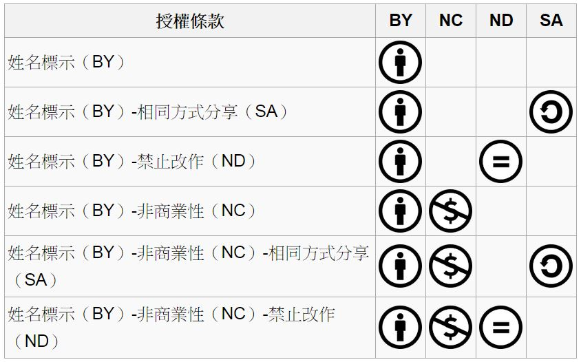

# 雜誌訊息

## 投稿須知

*給專欄寫作者：* 做公益不需要有壓力。如果您願意撰寫專欄，您可以輕鬆的寫，如果當月的稿件出不來，我們會安排其他稿件上場。

*給網誌捐贈者：* 如果您沒時間寫專欄或投稿，沒關係，只要將您的網誌以 [創作共用的「姓名標示、非商業性、相同方式分享」授權] 並通知我們，我們會自動從中選取需要的文章進行編輯，放入適當的雜誌當中出刊。

*給文章投稿者：* 程式人雜誌非常歡迎您加入作者的行列，如果您想撰寫任何文章或投稿，請盡可能用 markdown 編輯好您的稿件，並於每個月 25 日前投稿到 [少年科技人社團] 的檔案區，我們會盡可能將稿件編入隔月1號出版程式人雜誌當中，也歡迎您到社團中與我們一同討論。

如果您要投稿給程式人雜誌，我們最希望的格式是採用 markdown 的格式撰寫，然後將所有檔按壓縮為 zip 上傳到社團檔案區給我們， 如您想學習 markdown 的撰寫出版方式，可以參考 [看影片學 markdown 編輯出版流程] 一文。

如果您無法採用 markdown 的方式撰寫，也可以直接給我們您的稿件，像是 MS. Word 的 doc 檔或 LibreOffice 的 odt 檔都可以，我們
會將這些稿件改寫為 markdown 之後編入雜誌當中。

## 智財權注意事項

當您投稿時，最重要需注意的一件事情，是智慧財產權的問題。

您必須確定投搞的文章沒有侵權的問題！

如果文章與圖片完全是您自行製作的，那應該不會侵權。但是如果您有使用網路上的圖片或修改網路上的文章，請務必採用沒有侵權疑慮的來源，像是 [維基百科] 或者 [創作共用](http://zh.wikipedia.org/zh-tw/%E5%88%9B%E4%BD%9C%E5%85%B1%E7%94%A8) 授權的文章，並且標明修改來源。

舉例而言，如果您修改自維基百科，請標上「本文修改自維基百科」，如果是其他「創作共用」文章或圖片，則需要附上原始文件或圖片的連結。

以下是「創作共用」文章的授權類型，您可以在標識姓名來源後採用「姓名標示（BY）」與「
姓名標示（BY）-相同方式分享（SA）」這兩類授權的文章，也可以在特別標示授權後採用「姓名標示（BY）-非商業性（NC）」或「姓名標示（BY）-非商業性（NC）-相同方式分享（SA）」的文章，但是不要採用有「禁止改作（ND）」的文章來進行衍生創作。

## 參與編輯
您也可以擔任程式人雜誌的編輯，甚至創造一個全新的公益雜誌，我們誠摯的邀請您加入「開放公益出版」的行列，如果您想擔任編輯或創造新雜誌，也歡迎到 [少年科技人社團] 或 [程式人雜誌社團] 來與我們討論相關事宜。

## 公益資訊

------------------------------------------------------------------------------------------------------------------------------------------------------------
公益團體                          聯絡資訊                        服務對象                                    捐款帳號
-------------------------------   -----------------------------   -----------------------------------------   -------------------------------------------
財團法人羅慧夫顱顏基金會          <http://www.nncf.org/>      顱顏患者                                    銀行：009彰化銀行民生分行 
                                  <lynn@nncf.org>             (如唇顎裂、小耳症或其他罕見顱顏缺陷）        帳號：5234-01-41778-800
								  02-27190408分機 232 

社團法人台灣省兒童少年成長協會    <http://www.cyga.org/>      單親、隔代教養.弱勢及一般家庭之兒童青少年   銀行：新光銀行  
                                  <cyga99@gmail.com>                                                      戶名：台灣省兒童少年成長協會  
								  04-23058005                                                                 帳號：103-0912-10-000212-0
-------------------------------   -----------------------------   -----------------------------------------   -------------------------------------------

[看影片學 markdown 編輯出版流程]:https://dl.dropboxusercontent.com/u/101584453/pmag/201304/htm/video1.html
